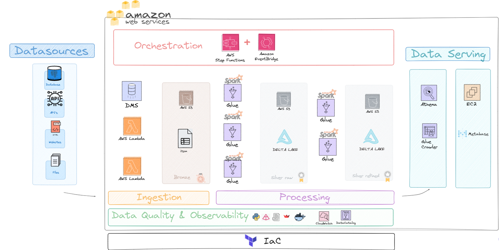

# Home

> 💾 Applied Project Doc - XPE 2024
(Final stage of the MBA - Cloud Data Engineering)

## Table of Contents

* `Intro` - Motivation / Objectives 💡
* `Solution` - Main concepts and stacks. 📐
* `Ingestion Framework` - Main features that included some cool practices 📋
* `Metabase` - Why Metabase? 📊
* `Price` - Development Cost + Production Price Projection 💵
* `Results` - Final Discussions 🎓
* `Others` - in Development 🔧
* `Presentation` - in Development 🔧