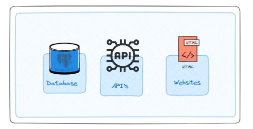

# Solution

The goal here is not to delve into every detail of what was used, but rather to explain the core elements of the solution and some details about the concepts and tools employed. We will break it down into parts to make it easier to understand each stage.

## Data Sources

For our project, we primarily used two sources (with multiple endpoints), as one might expect a financial solution to operate. We utilized a paid API that ensures data curation, availability (without slowdowns during peak hours), and high-frequency updates.

> 💻 **Note**: Relying solely on public sources and web scraping does not guarantee quality and also demands tremendous effort. Cost-effective API solutions exist and are quite affordable; for instance, an enterprise-level service might cost about BRL 200 per month.

For our volume and frequency, a simple service costing BRL 20 per month sufficed, saving me a great deal of time and the risk of source failure (in cases where only web scraping is used).

### Data Sources Used:
* **API BRAPI**
    * This included endpoints for stocks, FIIs, cryptocurrencies, historical data, and stock dividends.
* **Web scraping from a FIIs assets site**
    * Focused solely on FIIs data.

The idea here was to demonstrate that our solution could ingest data in three formats: APIs, web scraping, and legacy databases. I will detail this in the ingestion section. This approach was experimental, and the logic developed could be replicated based on these established bases.

