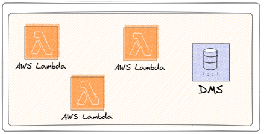

# Solution

## AWS Serverless Architecture

> 💻 **Note**: If you are not familiar with what serverless resources are, the topic will be discussed in the results section and additional materials will be provided in the reference section.

The goal here is not to delve into every detail of what was used, but rather to explain the core elements of the solution and some details about the concepts and tools employed. We will break it down into parts to make it easier to understand each stage.

## Data Sources

For our project, we primarily used two sources (with multiple endpoints), as one might expect a financial solution to operate. We utilized a paid API that ensures data curation, availability (without slowdowns during peak hours), and high-frequency updates.

> 💻 **Note**: Relying solely on public sources and web scraping does not guarantee quality and also demands tremendous effort. Cost-effective API solutions exist and are quite affordable; for instance, an enterprise-level service might cost about BRL 200 per month.

For our volume and frequency, a simple service costing BRL 20 per month sufficed, saving me a great deal of time and the risk of source failure (in cases where only web scraping is used).

### Data Sources Used:
* **Brapi API**
    * This included endpoints for stocks, FIIs, cryptocurrencies, historical data, and stock dividends.
* **Web scraping from a FIIs assets site**
    * Focused solely on FIIs data.

The idea here was to demonstrate that our solution could ingest data in three formats: APIs, web scraping, and legacy databases. I will detail this in the ingestion section. This approach was experimental, and the **logic developed** could be **replicated based** on these established bases.

## Ingestion

With the data sources defined, the initial step was to construct three AWS Lambda functions:

* **Stock Data Lambda**:
    * Handles data for 10 stocks due to API call limit restrictions.
* **Crypto Data Lambda**:
    * Initially manages data for only 2 assets.
* **FIIs Data Lambda** (Web Scraping):
    * Scrapes approximately 30 assets per run.

Database Setup on AWS RDS

Following the Lambda setup, a PostgreSQL database was established on AWS RDS. **This setup was intended to simulate the migration from a legacy database system**. The database includes historical data and dividend information for stocks.

The aim was to address data ingestions from the most common types of sources during the ingestion phase, demonstrating the versatility of the serverless architecture.

## Process/Transform

With the data ingested into AWS from the previous step, AWS Glue was chosen as the processing and transformation resource. This choice was made because Glue supports Spark and allows for the use of Python. However, considering that the solution needed to scale effortlessly, implementing it with Spark from the outset significantly increases the update frequency of the Lambdas and allows scaling the number of Lambdas without impacting the performance of the transformation and processing stage.

####  Developed Glue Jobs

Five jobs were developed in Glue:

1. **Stocks Raw** - Primarily involves removing duplicates from the source and saving these files in delta format.
2. **Webscrap Raw** - Involves removing duplicates from the source and saving these files in delta format.
3. **Crypto Raw** - Involves removing duplicates from the source and saving these files in delta format.
4. **Historical Dividend** - Merges (with a join) the output of the first job with historical data that came from the DMS migration.
5. **Stocks Refined** - Involves column selection, data typing treatment, and creation of calculated fields, simulating a trusted table being made available to the business.

> 🔎 **NOTE**: If you look at the codes, you will see only 3 scripts, because a way was developed for the first three to use the same script base, changing only their variables. All of this is automatically deployed via Terraform (variables / terraform.tfvars [hidden 🔒]).