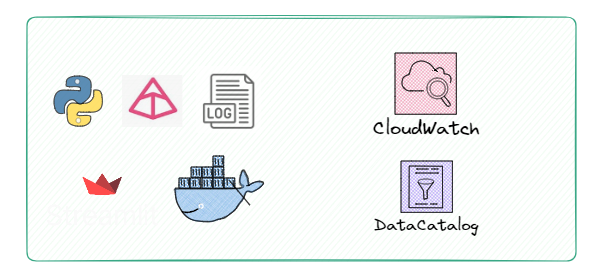

# Solution

## AWS Serverless Architecture

> 💻 **Note**: If you are not familiar with what serverless resources are, the topic will be discussed in the results section and additional materials will be provided in the reference section.

The goal here is not to delve into every detail of what was used, but rather to explain the core elements of the solution and some details about the concepts and tools employed. We will break it down into parts to make it easier to understand each stage.

## Data Sources

For our project, we primarily used two sources (with multiple endpoints), as one might expect a financial solution to operate. We utilized a paid API that ensures data curation, availability (without slowdowns during peak hours), and high-frequency updates.

> 💻 **Note**: Relying solely on public sources and web scraping does not guarantee quality and also demands tremendous effort. Cost-effective API solutions exist and are quite affordable; for instance, an enterprise-level service might cost about BRL 200 per month.

For our volume and frequency, a simple service costing BRL 20 per month sufficed, saving me a great deal of time and the risk of source failure (in cases where only web scraping is used).

### Data Sources Used:
* **Brapi API**
    * This included endpoints for stocks, FIIs, cryptocurrencies, historical data, and stock dividends.
* **Web scraping from a FIIs assets site**
    * Focused solely on FIIs data.

The idea here was to demonstrate that our solution could ingest data in three formats: APIs, web scraping, and legacy databases. I will detail this in the ingestion section. This approach was experimental, and the **logic developed** could be **replicated based** on these established bases.

## Ingestion

With the data sources defined, the initial step was to construct three AWS Lambda functions:

* **Stock Data Lambda**:
    * Handles data for 10 stocks due to API call limit restrictions.
* **Crypto Data Lambda**:
    * Initially manages data for only 2 assets.
* **FIIs Data Lambda** (Web Scraping):
    * Scrapes approximately 30 assets per run.

Database Setup on AWS RDS

Following the Lambda setup, a PostgreSQL database was established on AWS RDS. **This setup was intended to simulate the migration from a legacy database system**. The database includes historical data and dividend information for stocks.

The aim was to address data ingestions from the most common types of sources during the ingestion phase, demonstrating the versatility of the serverless architecture.

## Process/Transform

With the data ingested into AWS from the previous step, AWS Glue was chosen as the processing and transformation resource. This choice was made because Glue supports Spark and allows for the use of Python. 

Considering that the solution needed to scale effortlessly, implementing it with Spark from the outset significantly increases the update frequency of the Lambdas and allows scaling the number of Lambdas without impacting the performance of the transformation and processing stage.

####  Developed Glue Jobs

Five jobs were developed in Glue:

1. **Stocks Raw** - Primarily involves removing duplicates from the source and saving these files in delta format.
2. **Webscrap Raw** - Involves removing duplicates from the source and saving these files in delta format.
3. **Crypto Raw** - Involves removing duplicates from the source and saving these files in delta format.
4. **Historical Dividend** - Merges (with a join) the output of the first job with historical data that came from the DMS migration.
5. **Stocks Refined** - Involves column selection, data typing treatment, and creation of calculated fields, simulating a trusted table being made available to the business.

> 🔎 **NOTE**: If you look at the codes, you will see only 3 scripts, because a way was developed for the first three to use the same script base, changing only their variables. All of this is automatically deployed via Terraform (variables / terraform.tfvars [hidden 🔒]).

## Data Storage

### Data Storage Strategy

Data storage is a critical component at nearly every stage of the project, implemented using different object stores (AWS S3 buckets) according to the stage, following the best practices of Medallion architecture type. Data were segregated into three layers:

* **Landing** - Stores the ingested data in JSON format.
* **Bronze** - Stores data without duplicates in delta format.
* **Silver** - Stores data with joins, calculated columns, and business-specific columns.

> 🔎 **NOTE**: A Gold layer was not constructed because such layers generally require a project to be at a more advanced stage. Often, new projects are fed by tables from the Silver zone - trusted or refined. Additionally, the project development time was short, and there wasn’t enough time to consolidate a modeling strategy.

Having separate buckets for different layers offers several advantages, such as having a more historical layer and a more analytical one. As the project evolves, it becomes possible to determine the necessary range of data for generating value, allowing for different configurations in the S3 buckets, such as having a replica for backup purposes in the historical layer. 

While not applied here, it is also possible to configure a range (based on dates) to store older data in a colder storage layer, meaning these less accessed data will essentially hibernate, reducing costs. These are some of the advantages of the implemented approach, and as the project progresses and more is understood about the business, even more features aimed at performance and cost reduction can be configured.

#### Delta Format

In addition to the above optimizations, the Delta file format was utilized for the analytical layers, enhancing performance and reducing costs through ACID transactions and schema enforcement. These features maintain data integrity and consistency and support efficient querying with mechanisms like file skipping and Z-ordering.

While not all advanced features were leveraged (becuase of the time), significant learning were gained regarding the fundamental aspects of Delta Lake and its practical application within the AWS Glue environment (not trivial like Dbricks). This strategic decision supports transitioning towards a lakehouse architecture, which optimizes both batch and real-time data processing, and provides a scalable framework for future enhancements.

## Data Serving

Once all the data has been processed and transformed, the AWS Athena tool can access these tables, which were crawled by the Glue Crawler. This setup recognizes data structures and can significantly benefit from potential performance and cost optimizations. However, it's important to note that in this specific instance, optimizations using Hive or Delta for query enhancements were not utilized due to time constraints, although such enhancements are certainly possible.

Following this, an EC2 instance with 8 GB of RAM and 2 CPUs is launched to support at least 10 analysts and dashboards. This setup, which is quite performant, likely exceeds the current needs. On this Linux machine, PostgreSQL and Metabase are installed. PostgreSQL stores the state and volume data for Metabase.

With Metabase operational, a quick and intuitive configuration process is carried out, including the creation of user accounts and connections. Metabase is directly linked to Athena, ensuring that every query run accesses data through Athena and is served via Metabase’s interface. 

This setup allows data or business analysts to access data without needing to directly interact with AWS, and facilitates the publishing of dashboards and queries to Google Sheets and Google Presentations.

This architecture not only secures high-performance data querying and low-cost operations on the silver data layers but also enhances accessibility and usability for analysts through a user-friendly dashboard interface.

> 🏁 **NOTE** Here we reach the conclusion of the main points that were developed. Below, some descriptions about the remaining items will be provided, but there will be more discussions about the learnings encountered in the results session.

## Others 📎

### Orchestration

In this project, two other serverless resources were utilized, which together function similarly to Airflow. However, given the convenience of creating DAGs with AWS Step Functions and the limited time factor, this was the chosen approach for now.

In the cost section, it will be seen that this is undoubtedly a good option in this analysis, but in terms of management, it is believed that Airflow is more robust and a more complete tool. However, the choice was also about seizing an opportunity to learn, experiment, and particularly value time efficiency.

It's worth noting that this tool has an easy implementation and monitoring of DAGs similar to Airflow. Below is the dashboard showing the latest runs of a pipeline orchestrated by Step Functions:

### Data Quality & Observability

AWS already hosts a variety of services that are essential for two crucial aspects of data lifecycle management: data quality and observability. However, the focus was more on utilizing CloudWatch and Datacatalog. Additionally, there was an exploration into developing a custom tool tailored for specific needs. It's understood that there were numerous constraints in previous roles which shaped this approach.

Firstly, using the Pydantic library, a sort of data contract was created, specifying some columns as mandatory during data ingestion to ensure data quality with key fields always populated.

Secondly, within all the Lambdas and some Glue scripts, a method was devised to monitor pertinent metrics, such as process time, file size, and log collection, verifying if they succeeded according to the set logic. These logs are stored in an S3 environment, accessed via boto3 within Docker, and visualized in Streamlit. While recognizing that this approach isn't the most efficient compared to existing, superior solutions, it was more about highlighting the importance of these metrics and prioritizing my time effectively.

-----