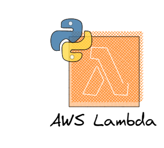
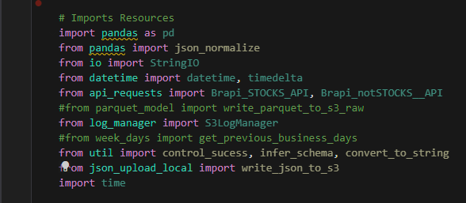
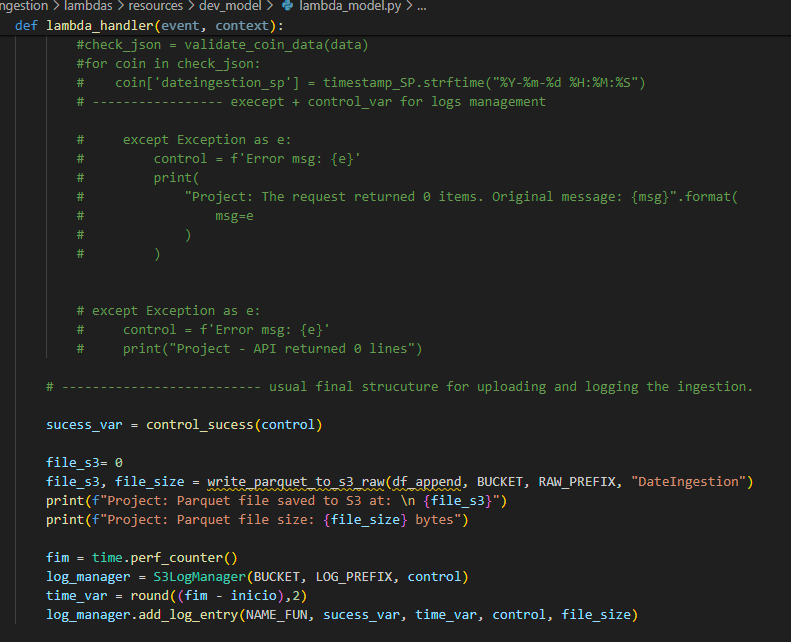
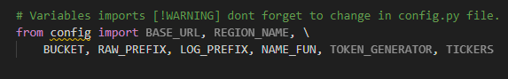

# Ingestion Framework

This section highlights the development aspects of data ingestion and the initial processing layer. A framework was established for data ingestion, designed to facilitate the addition of new sources quickly, emphasizing the importance of standardization and step-by-step guidance for creating and replicating new Lambdas, which proved extremely useful in this context.

## Lambdas

Lambdas, essentially serverless functions (managed by AWS, which takes care of the infrastructure and resources needed), can be configured with basic settings like the programming language and system architecture (x86_64). However, those familiar with Lambdas often encounter lengthy and complex scripts that are challenging to read and debug.

The goal was to standardize a simple and organized way to develop and deploy these functions.

- Initially, standard function modules/classes were created for commonly used functions/instances in this context, such as sending received API JSON to a bucket, API interaction (which might vary depending on the API endpoint), data typing verification with Pydantic (subject to changes), log creation, and automatic sending to a bucket, among other functionalities.

- Typically, Lambdas are developed locally due to convenience (even using notebooks to speed up development), so these common libraries are automatically imported regardless of the directory path (to keep deployment organized). Lambda functions always follow the same structure to reuse functions and ensure correct log collection.

- Scripts were designed to eliminate all hard-coded variables, where each used variable would be accessed from a separate configuration file, allowing easy replication of a Lambda with the same endpoint and facilitating code readability and variable checking.

- With the script functional, the deployment stage follows. Utilizing the earlier steps, a straightforward method to deploy compound Lambdas (comprising more than one file) is through zipping. With this approach, common resources are already inside the standard zip, which is copied to a new directory where lambda_function.py/config.py and possibly another file with specific requirements are updated.

With all the points above addressed, the rest involves simply replicating the resource with necessary configurations via Terraform, requiring only the path of the zip file. This ensures high ease of replication for similar services, where, for instance, only the assets in the config file need to be added or modified. This setup is integrated into the Step Functions of Terraform, enabling high speed and potential for automation.

The final idea, which was not developed due to time constraints, involved using a form input to check for ingested stocks via an endpoint. If a particular asset was missing, a bash script would create the configuration file and replicate the resource automatically.

For cases involving new pipelines or different endpoints, this approach remains highly beneficial as it always allows for reuse of components and leverages Infrastructure as Code (IaC) to save many configurations that would be time-consuming through the interface.

Additionally, some practices were adapted for use in Glue, where the three silver-raw jobs utilize the same script, with only variables in the Terraform files being adjusted. Thus, at least in the initial processing stage, development speed and standardization are also ensured, practices that are highly valuable and consistently add significant value to the project when well implemented.
