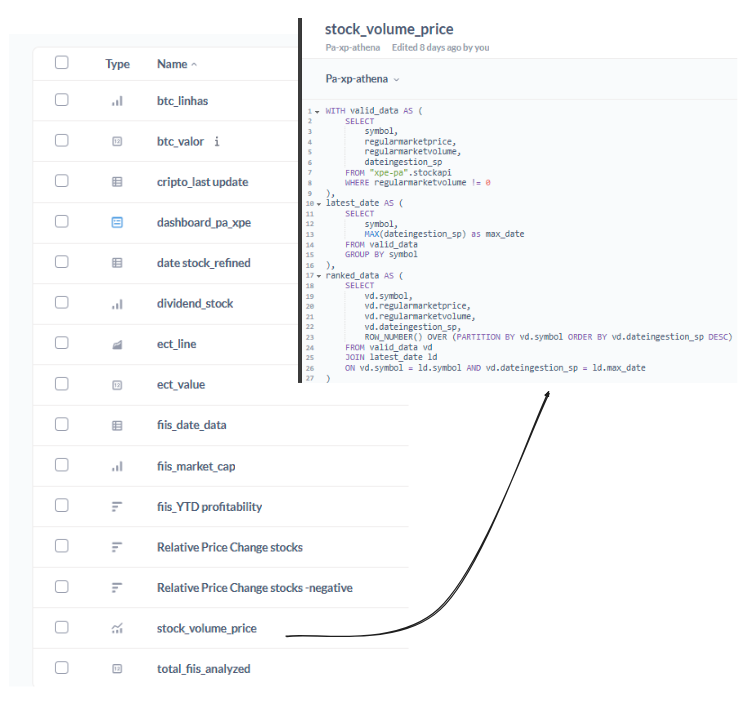
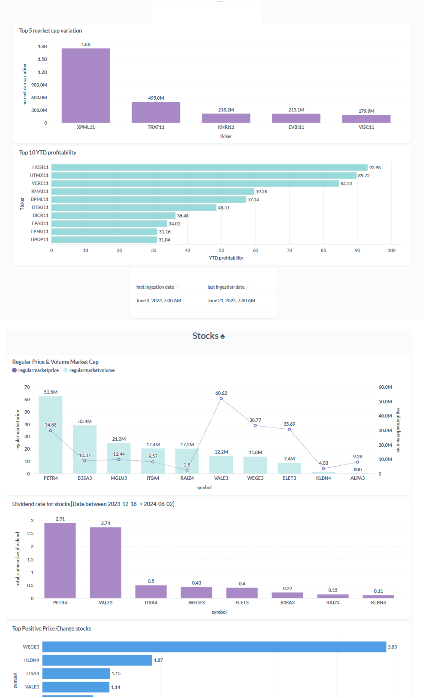

# Metabase / Dashboard

## Metabase

Initially, there was an interest in experimenting with Apache Superset, but due to limited materials on connecting it with Athena, the decision was made to switch to Metabase. Opting out of Power BI was intentional, as the aim was to explore a different tool that could utilize a Docker image, furthering learning experiences on AWS. The choice of Metabase proved rewarding, revisiting it with more knowledge gained since first using it as a data consumer during an internship in data science.

Therefore, let's highlight the advantages of this choice:

Imagining a scenario where a company does not adhere to the standard Microsoft stack and aims for agility and cost reduction, Metabase emerges as an excellent choice. From a cost perspective, for 10 analyst users plus dashboards, the expense was estimated at only $30 per month, whereas Power BI would cost $100 for the same number of users. The installation process is relatively straightforward, running a docker-compose on EC2 with some additional configurations, and quickly, it's up and running with a PostgreSQL database maintaining its state and managing its volume.

Once operational, configuring it via their interface is swift, allowing the creation of different access groups, such as query creators or readers of pre-made queries, etc. There's a wealth of settings available aimed at enforcing security best practices as well as cost and performance optimization. Queries are entirely managed through SQL, which is beneficial from a language standpoint, avoiding the need to learn the more peculiar syntax often associated with data visualization tools.

In terms of performance, Metabase uses Athena as its querying engine, essentially building a platform on top of Athena, which ensures high performance. With Athena's metadata, it's possible to track which queries are most frequently run and devise strategies to reduce costs. This integration not only enhances performance but also aligns with efficient data management practices.

In Metabase, publishing or embedding questions is straightforward and effortless, enhancing delivery speed and ensuring the reuse of questions across different dashboards. This efficiency significantly reduces development time. Such features are particularly well-suited to the context of an initial data project that needs to be structured and deliver value quickly. This capability allows teams to rapidly iterate on insights and visualize trends without needing to recreate queries for different analytical perspectives.

## Dashboard

Due to security concerns, the link to the Metabase dashboard will not be shared. For access, all ports were left open, prioritizing ease of exploration over security. This was a deliberate choice to experiment with the tool without extensive setup. However, it's important to remember that in a professional setting, several security measures can be implemented, such as embedding the dashboard within a secured website that requires login, or allowing read-only access within Metabase.

This approach ensures that the dashboard is accessible via the web, making it easy to share with clients or colleagues as needed, while highlighting the flexibility of Metabase for quick deployment and iterative testing in data-driven projects.

Additionally, the analyses conducted were somewhat random, with the primary intention of exploring the tool's capabilities rather than diving deeply into business analytics or generating substantial insights. This approach was taken due to time constraints and the exploratory nature of the project.

The main purpose of this dashboard is to complete the project cycle—from data source to data serving—enabling business analysts who understand the domain to engage in meaningful discussions and perform analyses that deliver value to the client. This setup allows for quick setup and iterative exploration, which is crucial in early stages of data projects where the focus is on structuring and rapid value delivery.

------
