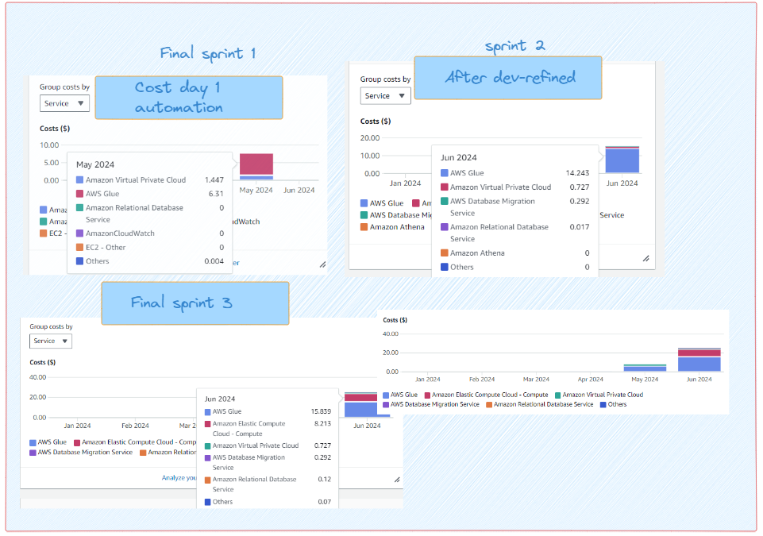
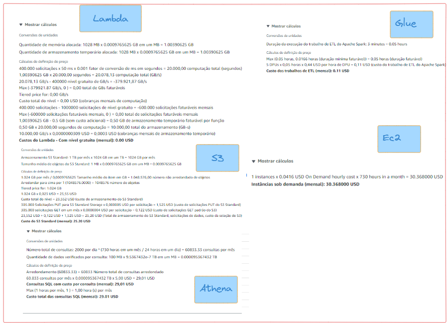
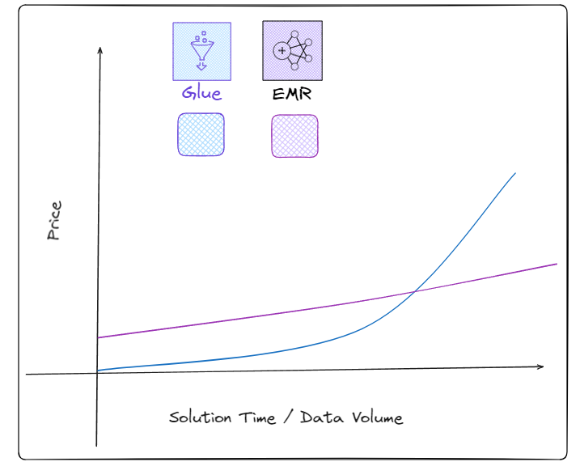

# Price

## Development cost 📋

Based on the AWS billing estimate, the development environment is projected to cost $38 by the end of June. This budget accounts for a development phase filled with trial and error and various experiments without exceeding **$50.**

> 💻 **Note**: A $300 AWS experimentation coupon was received, which facilitated a more fearless approach to experimenting in this proof of concept (PoC). This financial buffer allowed for extensive testing and exploration without significant cost concerns.

While the current development setup is estimated to cost $38 by the end of June, this scenario primarily serves to demonstrate the functionality of the solution in a controlled, low-cost environment. However, there's a recognition that the costs for deploying the solution in a production environment, particularly for a micro or small business, might be significantly different.

To address this, there's been a proposal to project future costs when scaling the solution to a production setting.

## Production Price Projection 💵

The concept here was indeed to increase the volume of incoming data and the frequency of runs in the pipeline for the proof of concept development. Initially, there were effectively four data sources, one of which was solely to demonstrate data migration from legacy databases—highlighting the versatility of the solution. Thus, essentially three Lambdas were operational: one for stocks and FIIs (via the BRAPI API), a second for web scraping real estate funds, and a third for cryptocurrencies (also via the BRAPI API).

Within these Lambdas, approximately thirty assets were handled by the web scraping function, five by the cryptocurrency function, and ten by the stocks function. For a scenario projecting around 1000 assets, it would require scaling up to about one hundred Lambdas (with an allocation of 70% for stocks/FIIs, 20% for web scraping, and 10% for cryptocurrencies) to maintain efficiency. Considering the update frequency—given that the target personas are primarily holders, who don't require frequent updates—a rate of ten updates per day was deemed satisfactory. It's feasible to run numerous distinct Lambdas with a single instance of AWS Glue processing similar types of data, such as different stocks pulled from the same API.

With these assumptions in mind, the cost projection involves configuring the resources appropriately and calculating the total number of executions per month. This would give a clearer picture of the operational costs expected when scaling up the solution for a micro or small business in a production environment. This strategic planning is crucial to balance performance needs with cost efficiency.

> price calculated on June 19, in the US-East-2 region

There are some additional resources not listed here, but the total for the rest (Step Functions, Amazon Bridge Scheduler, VPS, etc.) does not even reach **$5** per month.

### Lambda

Calculations were based on some Lambdas running more than ten times a day. Even with each Lambda running over 100 times daily, we will still remain within the free tier:
100 (Lambdas) * 100 (runs) * 30 (days) = 300,000 requests. Hence, Lambda usage for our case is essentially free.

### S3 (Object Store)

This is our storage layer. Calculations were made assuming data volumes of 1TB, with partial replicas for more critical data (backup), with many requests (300K per month). Given that our current volume is much lower due to the business nature, the cost is expected to be significantly lower, especially in the first year of production. Since our data will be consumed by Athena, this greatly reduces expenses on external transfers, which are usually the costliest aspect of any Object Store.

### Athena

Queries were estimated for sweeping through hundreds of thousands of lines (about 100 MB), and I estimated how many queries an analyst might make per day, arriving at about 32. Even multiplied by 10 analysts, we are well below the 2,000 queries I projected, thinking about having dashboards in production, business queries, data science, etc. There is still much room to optimize and further reduce this cost, but even with higher estimates and minimal optimization, the cost is quite low.

### EC2

Our Metabase is hosted on EC2, where I tried to project a machine that can support at least 10 analysts querying simultaneously and sustain the dashboards in production. As previously mentioned, these $30 per month are much cheaper than at least $100 (just for the analysts) with PowerBI.

### Glue

The calculator shows the price of each Run with our current settings. I estimated the execution time high; currently, runs take about 50 to 62 seconds max, but I set it to 180 seconds to account for an increase in volume. Remember, we have several potential optimizations to make in the future to reduce this value significantly. However, as this was a v0 simulation, I wanted to estimate this price with a higher data volume. We currently have 5 Glues running daily, which could easily support all 100 Lambdas with minor adaptations (literally zero modifications for stocks). Thus:
5 (Lambdas) * 10 (runs/day) * 30 days = 1,500 runs * $0.11

This comes to approximately $165 per month. Indeed, the processing stage is the most expensive we have, but it remains cost-effective, given that we are dealing with highly scalable distributed computing without worrying about almost any cluster and system configuration settings.

### Total Price
* $25 (S3) + $29 (Athena) + $30 (EC2) + $6 (other services) + $165 (Glue)
* $255 per month | $3,060 per year

## Glue/Serverless price discussion

Consultations with several senior professionals in the field have indicated that the price for Glue serverless is exceptionally low, even for solutions aimed at micro/small businesses. It's important to note that all resource costs have been estimated high, and there remains significant room for optimization. A particular point of interest is that making these high estimates without extensive testing on Glue has likely inflated the price, as various optimizations could be implemented during the move to production to reduce costs. Furthermore, the lack of data on runs with higher volumes means that the projection for Spark's performance and time requirements is more qualitative.

It’s also worth discussing whether, given these costs, it might be advisable to have a dedicated resource for our Spark jobs. The answer isn't straightforward. When discussing serverless architecture, some minor configurations are necessary, but ultimately, AWS handles the cluster configuration and ensures their availability, which justifies the higher service cost compared to managing your own resources. However, in startup scenarios and certain contexts, the cost for EMR services can initially be more expensive than the serverless solution. A review of some EMR configurations revealed that prices start at around $140 per month for a single core setup.

This discussion highlights the trade-offs between cost, management overhead, and scalability when choosing between serverless architectures and dedicated resources like EMR. Further exploration and cost-benefit analysis might be required to determine the best approach for specific business needs and growth stages.

This section delves into the finer details of the solution:

* Load Tolerance: Is the machine really going to handle the maximum load during peak hours?
* Upgrade Necessity: Might there be a need to upgrade or evolve this machine to handle increased loads (more costly configuration)?
* Monitoring and Configuration Time: How much time will be spent monitoring and actually finding a configuration that matches the company's usage?
* Engineering Time: How many hours will engineers spend configuring this?
* EMR Usage Time: Will using EMR require more hours for each pipeline?

The discussion isn't merely about raw pricing. It also involves the cost of specialized human resources. The intent here is not just to advocate that serverless is better but to broaden the discussion beyond simple cost calculations because every business has its own pace and needs.

The point is raised because, in the future, it might be valid to move away from Glue to keep a better track of expenses. More customized tools tend to be less expensive, and there are several current solutions that could be implemented with a focus on costs. For example, using Terraform/GitOps to spin up an EMR at scheduled times to run jobs and then tear everything down, thus only paying for processing hours, could significantly reduce costs. However, this approach introduces greater complexity and requires a well-established business model since such a solution demands more time and labor to develop (more investment in human work hours).